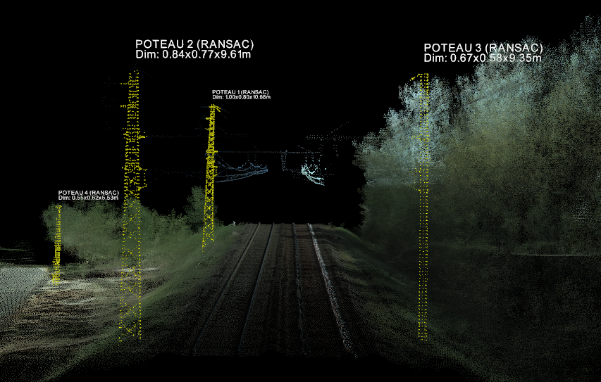
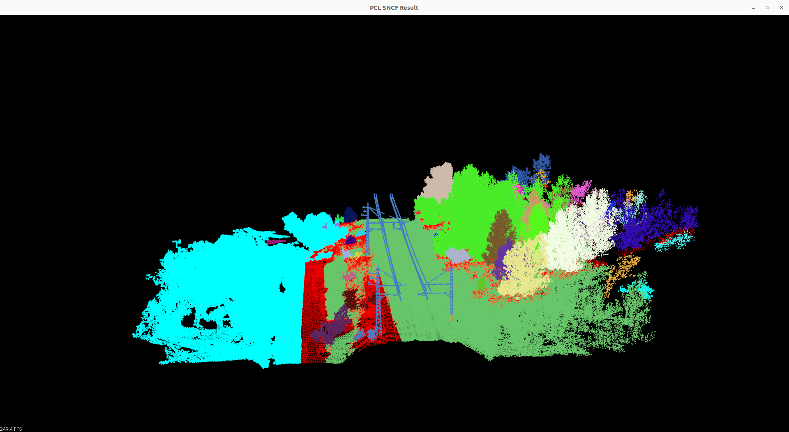
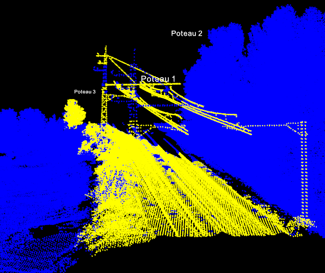

# 🚂 LiDAR-Based Railway Infrastructure Segmentation (Non-AI Approach)

## 🎯 Project Overview
The objective of this project is to **segment and isolate critical railway infrastructure components** (tracks, catenaries, poles) from raw 3D LiDAR point clouds. 

This project specifically explores a **Rule-Based / Heuristic approach**, deliberately avoiding Deep Learning (AI). This ensures a lightweight, explainable, and computationally efficient solution suitable for edge computing or real-time monitoring systems.

---

## 💻 Hardware Configuration 
**Laptop:** Lenovo IdeaPad S145-15API 
- **RAM:** 8 GB  
- **Processor:** AMD® Athlon 300u with Radeon Vega Mobile Gfx × 4 
- **Graphics:** AMD® Radeon Vega 3 Graphics

## 📊 Dataset Source
The data used in this project is sourced from the French Open Data platform:
* **Dataset Name:** [Nuage de points 3D des infrastructures ferroviaires](https://www.data.gouv.fr/datasets/nuage-de-points-3d-des-infrastructures-ferroviaires)
* **Source:** Data.gouv.fr / SNCF Réseau
* **Format:** The raw dataset provides download links to compressed **.laz** tiles.

---

## 📈 Project Evolution: From Prototyping to Performance
The development of this pipeline followed a two-step engineering approach:

1.  **Phase 1: Prototyping (Python & Open3D):** Initial R&D was conducted using **Open3D** to validate geometric heuristics.
2.  **Phase 2: Production-Ready (C++ & PCL):** To achieve industrial performance and handle large-scale railway tiles, the core engine was migrated to **C++ 17** using the **Point Cloud Library (PCL)**.

---

## 🏗️ Technical Achievements [Work in Progress 🚧]

### Poles Detection 
It is possible to obtain an accurate segmentation of poles, catenaries, and tracks by using the **RANSAC** algorithm combined with cluster extraction. 

Other segmentation techniques were explored, such as **Region Growing** or **Cylindrical Segmentation**, but they proved unsuitable for this specific use case (lattice structures). The current results are impressive considering they are obtained without AI. However, a simple RANSAC approach lacks object dimensions, leading to the next phase: **separating poles from catenaries and measuring them.**

### Data Attribute Analysis
Analysis via **CloudCompare** revealed that the LiDAR point cloud provides rich metadata: `Classification`, `Intensity`, `GPSTime`, `ReturnNumber`, `NumberOfReturns`, etc. 

The `NumberOfReturns` attribute specifically shows that railway lines, poles, catenaries, and tracks often share similar return signatures. This information is crucial because it makes decent semantic segmentation theoretically possible without AI. 

This highlights that LiDAR attributes are a path that should not be overlooked. However, as cables and poles remained merged in initial tests, a more advanced geometric approach was required.

### The Shift to Normal Estimation
An approach that was not initially considered is **Normal Estimation**. By calculating surface normals, we can determine the spatial orientation of objects. This is a key turning point for this project.

---

### ⚙️ Methodology & Empirical Tuning
A core challenge of this project was the **Empirical Optimization** of the algorithm. All parameters were determined through iterative testing to find the optimal balance between noise reduction and feature preservation.

### Current Work
The poles were detected succesfully on two point clouds. The process is shown on the following section.

### 🛠️ The Processing Pipeline

#### 1. Voxel Downsampling
Reduces the point cloud density while keeping relevant informations.
* **Empirical Choice:** `leafSize=0.12`.

#### 2. Statistical Outlier Removal (SOR)
Eliminates sensor noise ("laser dust") to prevent isolated noise points from acting as "bridges" between distinct objects.
* **Empirical Choice:** `meanK=50`, `StddevMulThresh=1.0`.

#### 3. NumberOfReturns Filtering 
The NumbersOfReturns field of the point cloud has shown that the blue values, which include poles, catenaries and rails can be used to segment the point cloud. Their values are close to 0. 
* **Empirical Threshold:** `1.0` .

#### 4. Normal Filtering
The normal is a unit vector $(n_x, n_y, n_z)$ perpendicular to the object surface at a given point. 
* The **$n_z$** value indicates horizontal (~0) or vertical (~1) orientation. 
* To isolate **poles**, we filter and keep points where the **$n_z$** value is **under 0.10**.

#### 4. Spatial Clustering (Euclidean)
Groups the remaining points into individual entities.
* **Empirical Tuning:** `ClusterTolerance=0.2m`, `MinSize=250`.

#### 5. Relative Height Analysis
RANSAC algorithm is used to detect the poles.
* **Empirical Choice:** `ModelType=SACMODEL_LINE`, `DistanceThreshold=0.5m`.
The poles detection is based on several criterias:  

* The height must be over **5.0m** and under **15.5m**.
* The verticality computed must be over **0.99**.
* The y dimension our the pole must be under **0.85m**.

---

## 🛠️ Tech Stack
* **Languages:** C++ 17 (Core Engine) / Python (R&D Prototyping)
* **Libraries:** [PCL (Point Cloud Library)](https://pointclouds.org/), [Open3D](http://www.open3d.org/)
* **Analysis Tools:** CloudCompare (Format conversion .laz to .pcd & Global Shift handling)
* **Build System:** CMake

## 🌍 Impact & Use Cases
* **Railway Maintenance:** Automated clearance checks and vegetation risk management.
* **Digital Twins:** Rapid generation of classified 3D models for BIM integration.
* **Explainability:** 100% transparent classification logic, crucial for safety-critical infrastructure.