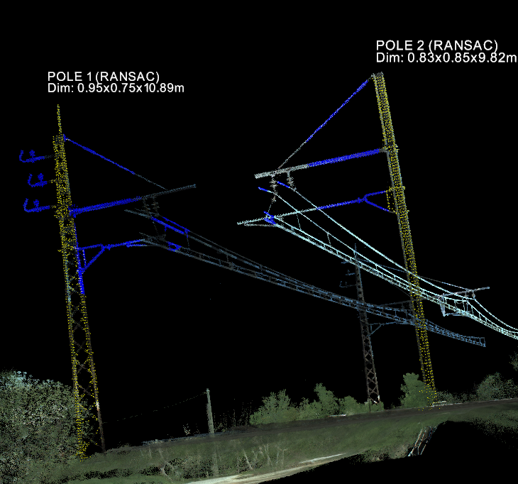
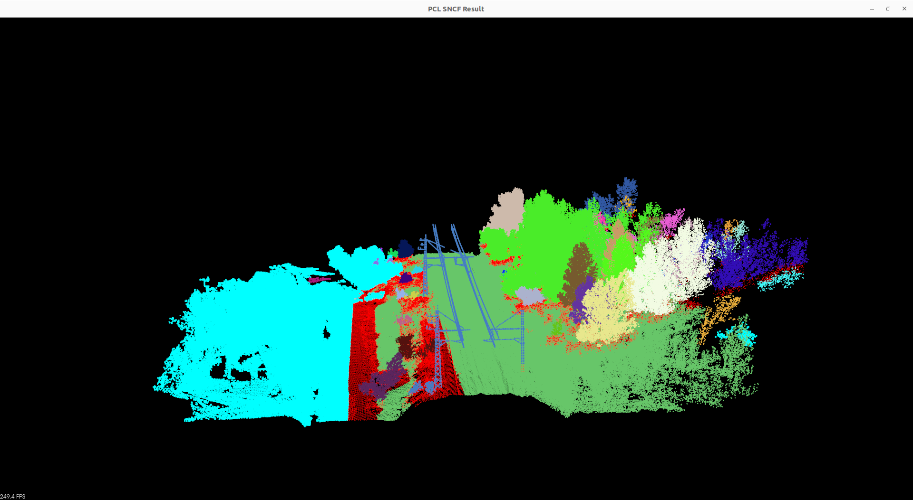
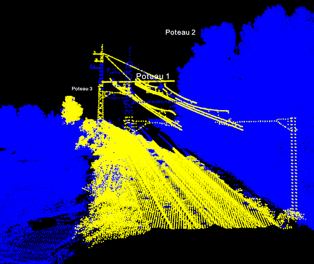

# 🚂 LiDAR-Based Railway Infrastructure Segmentation (Non-AI Approach)

## Current Results

## 🎯 Project Overview
The objective of this project is to **segment and isolate critical railway infrastructure components** (tracks, catenaries, poles) from raw 3D LiDAR point clouds. 

This project specifically explores a **Rule-Based / Heuristic approach**, deliberately avoiding Deep Learning (AI). This ensures a lightweight, explainable, and computationally efficient solution suitable for edge computing or real-time monitoring systems.

---

## 💻 Hardware Configuration 
**Laptop:** Lenovo IdeaPad S145-15API 
- **RAM:** 8 GB  
- **Processor:** AMD® Athlon 300u with Radeon Vega Mobile Gfx × 4 
- **Graphics:** AMD® Radeon Vega 3 Graphics

## 📊 Datasets Source
The data used in this project are sourced from the French Open Data platform and Hungarian State Railways :
* **Dataset 1:** [Nuage de points 3D des infrastructures ferroviaires](https://www.data.gouv.fr/datasets/nuage-de-points-3d-des-infrastructures-ferroviaires)
* **Dataset 2:** [Hungarian MLS point clouds of railroad environment and annotated ground truth data](https://data.mendeley.com/datasets/ccxpzhx9dj/1)
* **Format:** The raw dataset provides download links to compressed **.laz** tiles.

---

## 📈 Project Evolution: From Prototyping to Performance
The development of this pipeline followed a two-step engineering approach:

1.  **Phase 1: Prototyping (Python & Open3D):** Initial R&D was conducted using **Open3D** to validate geometric heuristics.
2.  **Phase 2: Production-Ready (C++ & PCL):** To achieve industrial performance and handle large-scale railway tiles, the core engine was migrated to **C++ 17** using the **Point Cloud Library (PCL)**.
3.  **Phase 3: Poles Detection:** The goal is to detect poles on every point cloud from the SNCF dataset.

---

## 🏗️ Technical Achievements [Work in Progress 🚧]

### Poles Detection 
This figure shows that it is possible to obtain an accurate segmentation of poles, catenaries, and tracks by using the **RANSAC** algorithm combined with cluster extraction. 

Other segmentation techniques were explored, such as **Region Growing** or **Cylindrical Segmentation**, but they proved unsuitable for this specific use case (lattice structures). The current results are impressive considering they are obtained without AI. However, a simple RANSAC approach lacks object dimensions, leading to the next phase: **separating poles from catenaries and measuring them.**

### Data Attribute Analysis
Analysis via **CloudCompare** revealed that the LiDAR point cloud provides rich metadata: `Classification`, `Intensity`, `GPSTime`, `ReturnNumber`, `NumberOfReturns`, etc. 

The `NumberOfReturns` attribute specifically shows that railway lines, poles, catenaries, and tracks often share similar return signatures. This information is crucial because it makes decent semantic segmentation theoretically possible without AI. 

This highlights that LiDAR attributes are a path that should not be overlooked. However, as cables and poles remained merged in initial tests, a more advanced geometric approach was required.

### The Shift to Normal Estimation
An approach that was not initially considered is **Normal Estimation**. By calculating surface normals, we can determine the spatial orientation of objects. This is a key turning point for this project.

---

### ⚙️ Methodology & Empirical Tuning
A core challenge of this project was the **Empirical Optimization** of the algorithm. All parameters were determined through iterative testing to find the optimal balance between noise reduction and feature preservation.

## 🚧 Current Work
Poles are detected. A global search is performed around the raw cloud with poles coordinates to detect cantilevers.

### 🛠️ The Processing Pipeline

#### 1. PDAL to PCL conversion & NumberOfReturns Filtering 
The NumbersOfReturns field of the point cloud has shown that the blue values, which include poles, catenaries and rails can be used to segment the point cloud. Their values are close to 0. 
* **Empirical Threshold:** `1.0` .

#### 2. Voxel Downsampling
Reduces the point cloud density while keeping relevant informations.
* **Empirical Choice:** `leafSize=0.08`.

#### 4. Normal Filtering
The normal is a unit vector $(n_x, n_y, n_z)$ perpendicular to the object surface at a given point. 
* The **$n_z$** value indicates horizontal (~0) or vertical (~1) orientation. 
* To isolate **poles**, we filter and keep points where the **$n_z$** value is **under 0.20**.

#### 4. Spatial Clustering (Euclidean)
Groups the remaining points into individual entities.
* **Empirical Tuning:** `ClusterTolerance=0.3m`, `MinSize=50`.

#### 5. Relative Height Analysis
RANSAC algorithm is used to detect the poles.
* **Empirical Choice:** `ModelType=SACMODEL_LINE`, `DistanceThreshold=0.6m`.
The poles detection is based on several criterias:  

* The height must be over **4.0m**.
* The verticality computed must be over **0.8**.
* The x & y dimension of the pole must be under **1.5m**.
* The Radial Deviation must be under **0.26ptm**.
* The Pole density must be over **80pts/m**.

#### 6. Results & Benchmarks

The algorithm was evaluated on two distinct datasets: **SNCF (France)** and **Hungarian State Railways (MÁV)**. This multi-dataset approach ensures the robustness of the RANSAC and Radial Deviation logic across different infrastructure standards.

##### A. SNCF Dataset (French Network)
*Focus: Standard catenary poles and poles with integrated ladders/platforms.*

| Point Cloud ID | Poles Detected | Accuracy | Processing Time | Observations |
| :--- | :---: | :---: | :---: | :--- |
| `railway_000033` | **4 / 4** | 100% | 33.69s | ✅ Success |
| `railway_000034` | **2 / 3** | 66.7% | 34.82s | ⚠️ 1 FN / 1 FP (Density: 70 pts/m) |
| `railway_000035` | **3 / 3** | 100% | 35.41s | ✅ Success |
| `railway_000036` | **3 / 3** | 100% | 31.60s | ⚠️ Pole #3 Incomplete capture |
| `railway_000037` | **6 / 6** | 100% | 35.30s | ✅ Success |
| `railway_000038` | **3 / 3** | 100% | 37.64s | ✅ Success |
| `railway_000040` | **4 / 5** | 80%   | 40.70s | ❌ 1 FN (Density: 75 pts/m) |
| `railway_000041` | **3 / 4** | 75%   | 33.41s | ⚠️ 1 FN / 1 FP (Density: 52 pts/m) |
| `railway_000042` | **3 / 3** | 100% | 29.89s | ⚠️ Pole #3 Incomplete capture |
| `railway_000043` | **3 / 4** | 75% | 31.45s | ❌ 1 FN (Complex structure) |
| `railway_000048` | **3 / 3** | 100% | 26.29s | ✅ Success |

**SNCF Metrics Summary:**
*   **Average Processing Time:** ~33.6s (Sequential)
*   **Total Poles Identified:** 37 / 41
*   **Overall Recall:** 90.2%

---

##### B. Hungarian State Railways Dataset (MÁV)
*Focus: Thin poles, lamp posts, and "A-frame" structures with wide-reaching bases.*

| Point Cloud ID | Poles Detected | Accuracy | Processing Time | Observations |
| :--- | :---: | :---: | :---: | :--- |
| `hungarian_01` | **2 / 2** | 100% | 34.14s | ✅ Success |
| `hungarian_02` | **3 / 4** | 75% | 49.94s | ❌ FN: Wide-base structure rejected |
| `hungarian_03` | **2 / 5** | 40% | 58.63s | ❌ FN: Thinner profiles below density threshold |
| `hungarian_04` | **4 / 4** | 100% | 49.55s | ✅ Success (Wide-base poles detected) |
| `hungarian_05` | **2 / 5** | 40% | 47.30s | ❌ FN: 3 wide-base poles missed |
| `hungarian_06` | **3 / 2** | 150% | 34.78s | ⚠️ FP: Giant pole detected (platform exterior) |
| `hungarian_07` | **3 / 3** | 100% | 39.93s | ✅ Success (Wide-base pole detected) |
| `hungarian_08` | **5 / 8** | 62.5% | 47.32s | ⚠️ Mixed: 3 FN / 1 lamp post FP |
| `hungarian_09` | **1 / 2** | 50% | 42.63s | ❌ 1 FN |
| `hungarian_10` | **7 / 6** | 116% | 43.34s | ⚠️ 1 FP: Lamp post identified as pole |
| `hungarian_11` | **7 / 4** | 175% | 36.53s | ⚠️ 3 FP: Urban lamp posts detected |

**Hungarian Metrics Summary:**
*   **Average Processing Time:** ~43.9s (Higher due to point density and fragmentation)
*   **Total Poles Identified:** 39 / 41 (Including FPs)
*   **Key Challenge:** High sensitivity to urban furniture (lamp posts) and wide-base geometry.

---

##### 🔍 Cross-Dataset Analysis

1.  **Impact of Base Geometry:** The Hungarian "A-frame" poles often exceed the **Radial Deviation** limit (0.45m), leading to False Negatives.
2.  **Density Disparities:** SNCF poles generally show higher point density per meter than the MÁV dataset, requiring more flexible thresholds for the Hungarian network.
3.  **False Positives (FP):** Lamp posts remain the primary source of error, as their vertical linearity mimics catenary poles.

---

##### 🔍 Technical Analysis & Failure Modes

1.  **False Positives (FP):** Primarily caused by **lamp posts** and high-density vertical objects. Their linear geometry is similar enough to catenary poles to pass the `SACMODEL_LINE` filter.
2.  **False Negatives (FN):** 
    *   **Thin Structures:** With a `VoxelGrid` of 0.1m, very thin poles lose too much point density to be clustered correctly.
    *   **Wide-Base Poles:** "A" or "H" shaped structures increase the **Radial Deviation** beyond the 0.45m threshold, causing the algorithm to reject them as "noise".
3.  **Incomplete Captures:** Occurs when `EuclideanClusterExtraction` splits a pole due to gaps in the point cloud (occlusions or low density at the top).

---

##### Technical Observations
* **Consistency:** The processing speed is highly stable around **24-25 seconds**. 
* **Bottlenecks:** File `000046` was significantly faster (21.24s), likely due to lower point density or fewer vertical candidates during the Euclidean Clustering stage.
* **Accuracy:** Missed poles in files 34, 39, and 46 are likely due to signal noise or proximity to catenary structures, requiring further refinement of the `ClusterTolerance`.

---

## 🚀 Performance Analysis & Benchmarks

The processing pipeline has been rigorously tested on **Ubuntu 22.04 LTS** using the **hungarian_3** dataset (~60Mb `.laz` file). This specific file represents the "worst-case scenario" in terms of point density and computational complexity, making it our primary benchmark for system reliability.

### 🛠 Test Configuration
*   **OS:** Ubuntu 22.04 / VS Code (CMake Tools)
*   **Parallelization:** OpenMP (leveraged for Voxel Filtering and Normal Estimation)
*   **Hardware:** Lenovo Laptop (Tests conducted on both Battery and AC Power)

### 📊 Benchmark Results (Dataset: hungarian_3)
The following measurements demonstrate the critical impact of hardware power management and compiler optimizations on execution time:

| Power Source | Build Mode | Voxel Size | Execution Time |
| :--- | :--- | :---: | :---: |
| 🔋 Battery | Debug | 0.08m | 58s |
| 🔌 AC Power | Debug | 0.08m | 45s |
| **🔌 AC Power** | **Release** | **0.08m** | **35s** |
| 🔌 AC Power | Release | 0.06m | 51s |

### 🔍 Key Observations

#### 1. Hardware-Level Optimization (Power Management)
Switching from battery to AC power resulted in a **23% performance gain** even in Debug mode. On battery, the CPU encounters strict power limits (throttling), which prevents the processor from reaching the high clock speeds required for efficient multi-threaded OpenMP operations.

#### 2. Release Mode & Vectorization
Switching to **Release mode (-O3)** while connected to AC power brought the execution time down to its record low of **35 seconds**. This improvement is due to the compiler's ability to utilize **SIMD vectorization**, which is crucial for the heavy geometric calculations involved in RANSAC and Normal Estimation.

#### 3. Resolution Sensitivity & Memory Safety
*   **The "Sweet Spot":** A voxel size of **0.08m** is the optimal balance. It maintains enough structural detail to detect catenary poles while ensuring the processing finishes in under 40 seconds.
*   **Computational Growth:** Reducing the voxel size to **0.06m** increased the runtime by nearly **50%** (to 51s), illustrating the cubic growth of data points in 3D space.
*   **Overflow Risk:** Setting the resolution too fine (e.g., `< 0.05m`) on large-scale datasets triggers an `Integer indices would overflow` error in PCL. This bypasses the downsampling stage, causing processing times to spike to over **170s** as the pipeline struggles with the raw data volume.

---

## 🛠️ Tech Stack

*   **Languages:** C++ 17 (Core Engine) / Python (R&D Prototyping)
*   **Libraries:** 
    *   [PCL (Point Cloud Library)](https://pointclouds.org/): Core processing, RANSAC line segmentation, and Euclidean cluster extraction.
    *   [PDAL (Point Data Abstraction Library)](https://pdal.io/): Used for advanced point cloud translation, filtering, and efficient format conversion (e.g., `.laz` to `.pcd`).
    *   [Open3D](http://www.open3d.org/): Visualization and geometric analysis.
*   **Data Preparation & Analysis:** 
    *   **CloudCompare:** Crucial for dataset preprocessing, including:
        *   **Spatial Segmentation:** Subdividing massive 1.4GB+ point clouds into smaller, manageable tiles to optimize memory usage and processing speed.
        *   **Global Shift Management:** Handling large coordinate offsets to maintain floating-point precision during geometric calculations.
        *   **Visual Validation:** Comparing ground truth data with algorithmic extraction results.
*   **Build System:** CMake

## 🌍 Impact & Use Cases
* **Railway Maintenance:** Automated clearance checks and vegetation risk management.
* **Digital Twins:** Rapid generation of classified 3D models for BIM integration.
* **Explainability:** 100% transparent classification logic, crucial for safety-critical infrastructure.